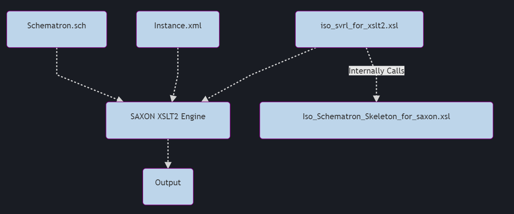
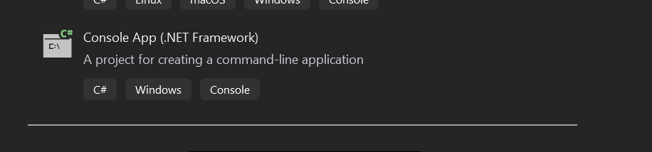
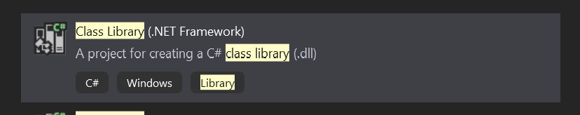
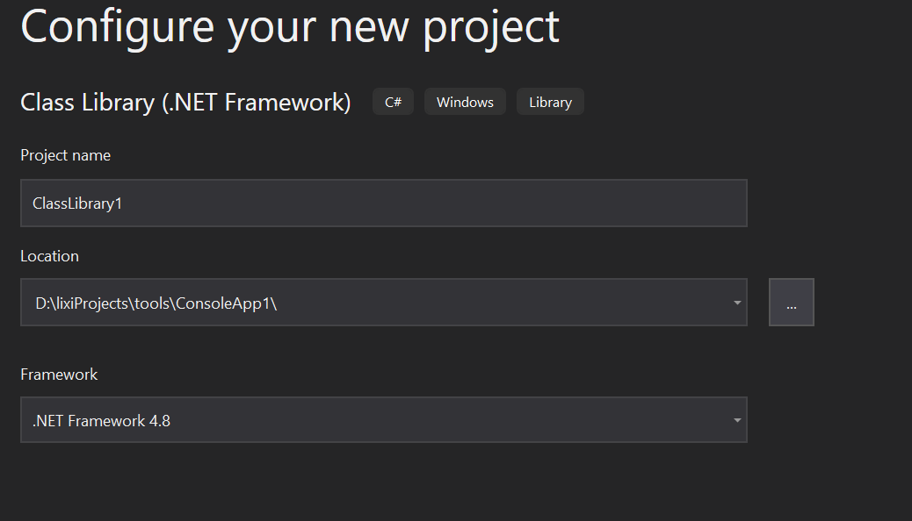
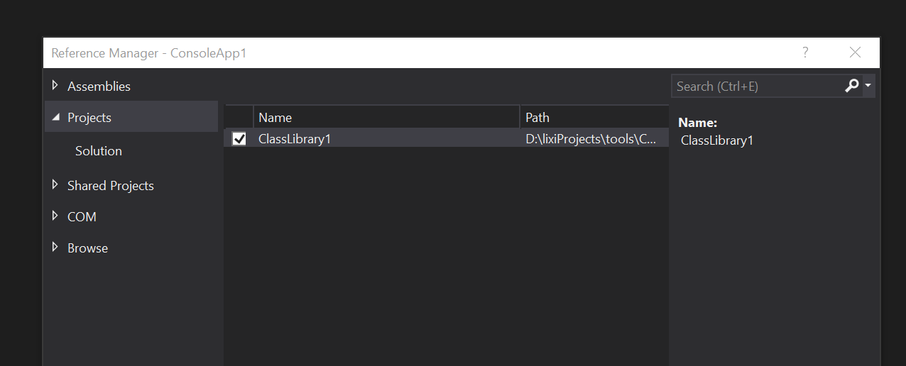
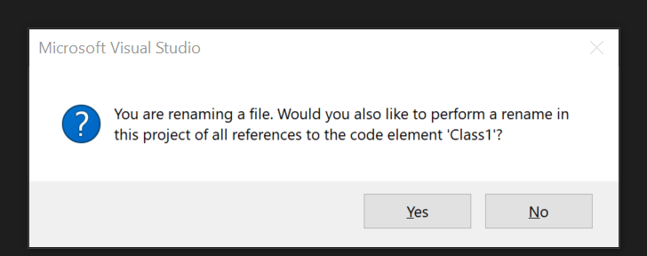
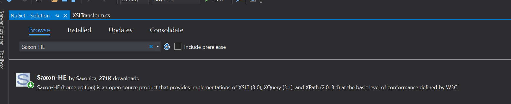
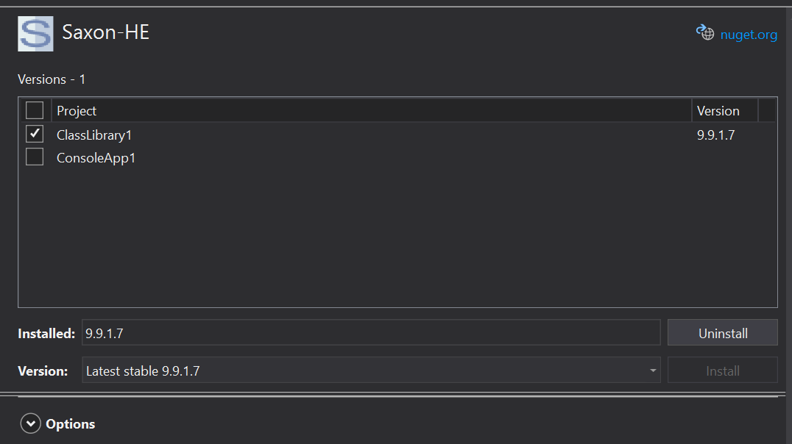
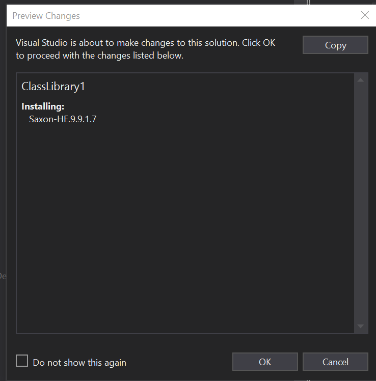

# Licence [MPL2](https://licenses.nuget.org/MPL-2.0)

# How to create a .net solution to test an xml document against an Schematron document.

## Schematron diagram



1. In visual studio Create a c# console app (Framework >= 4.6.1 )



2. right click the solution on the solution explorer view and click Add-->New Project
3. from the open up dialog search for the c# class library (.Net Framework) and click next



4. Navigate to the directory where the ConsoleApp you created in step 1 is located and click create



```code
Solution 'ConsoleApp1'(2 of 2 projects)
- ClassLibrary1
- ConsoleApp1
```

5. in the solution explorer right click ConsoleApp1 and click Add-->Reference
6. from left hand side select projects and from the open up list in the middle select ClassLibrary1 and click ok



7. under the ClassLibrary1 in solution explorer locate Class1.cs then press F2 to change it to XSLTransform.cs

`Note`: on the pop up dialog click yes to change all the reference to the element Class1



8. copy following code to inside XSLTransform.cs

```c#

using System;
using System.Collections.Generic;
using System.IO;
using System.Linq;
using Saxon.Api;
using System.Xml;

namespace ClassLibrary1
{
    public class XSLTransform
    {
        public Stream Transform(Uri xmluri, Uri xsluri)
        {


            // Create a Processor instance.
            Processor processor = new Processor();

            // Load the source document
            XdmNode input = processor.NewDocumentBuilder().Build(xmluri);

            // Create a transformer for the stylesheet.
            var compiler = processor.NewXsltCompiler();
            compiler.ErrorList = new List<StaticError>();

            XsltTransformer transformer = compiler.Compile(xsluri).Load();

            if (compiler.ErrorList.Count != 0)
                throw new Exception("Exception loading xsl!");

            // Set the root node of the source document to be the initial context node
            transformer.InitialContextNode = input;

            // Create a serializer
            Serializer serializer = processor.NewSerializer();
            MemoryStream results = new MemoryStream();
            serializer.SetOutputStream(results);

            // Transform the source XML to System.out.
            transformer.Run(serializer);

            //get the string
            results.Position = 0;
            return results;


        }

        public Stream Transform(Stream xmlstream, Stream xslstream)
        {

            // Create a Processor instance.
            Processor processor = new Processor();

            // Load the source document
            var documentbuilder = processor.NewDocumentBuilder();
            documentbuilder.BaseUri = new Uri("file://c:/");
            XdmNode input = documentbuilder.Build(xmlstream);

            // Create a transformer for the stylesheet.
            var compiler = processor.NewXsltCompiler();
            compiler.ErrorList = new List<StaticError>();
            compiler.XmlResolver = new XmlUrlResolver();
            XsltTransformer transformer = compiler.Compile(xslstream).Load();

            if (compiler.ErrorList.Count != 0)
                throw new Exception("Exception loading xsl!");

            // Set the root node of the source document to be the initial context node
            transformer.InitialContextNode = input;

            // Create a serializer
            Serializer serializer = processor.NewSerializer();
            MemoryStream results = new MemoryStream();
            serializer.SetOutputStream(results);

            // Transform the source XML to System.out.
            transformer.Run(serializer);

            //get the string
            results.Position = 0;
            return results;


        }

    }
}

```

9. go to tools-->NuGet Package Manager-->Manage NuGet Packages for Solution
10. on the Brows tap search for Saxon-HE and select the Saxon-HE by saxonica



11. on the right hand side select ClassLibrary1 and then click install



12. click ok on the preview change dialog



13. in solution explorer right click ClassLibrary1 then Add-->Class change the name to SchHelper.cs and click Add
14. copy following code inside the SchHelper.cs

```c#
using System;
using System.IO;
using System.Threading.Tasks;
using System.Xml;

namespace ClassLibrary1
{
    public class SchHelper
    {
        public static async Task Logger(Stream schematronError, string saveInPath)
        {
            using (var fileStream = File.Create(saveInPath))
            {
                schematronError.Seek(0, SeekOrigin.Begin);
                await schematronError.CopyToAsync(fileStream);
            }
        }
        public static async Task consoleLogErrorText(string path)
        {
            XmlReaderSettings setting = new XmlReaderSettings
            {
                Async = true
            };

            using (Stream error = new FileStream(path, FileMode.Open, FileAccess.Read))
            {
                using (XmlReader reader = XmlReader.Create(error, setting))
                {
                    XmlNamespaceManager nsmgr = new XmlNamespaceManager(reader.NameTable);
                    nsmgr.AddNamespace("svrl", "http://purl.oclc.org/dsdl/svrl");

                    while (await reader.ReadAsync())
                    {

                        if (reader.NodeType == XmlNodeType.Element && reader.Name == "svrl:text")
                        {
                            Console.WriteLine(reader.ReadElementContentAsString());
                        }
                    }
                }
            };

        }
        public static async void log(Stream schematronError, string saveInPath)
        {
            string path = Path.GetFullPath(Path.Combine("..", ".."));
            await Logger(schematronError, saveInPath);
            await consoleLogErrorText(path + @"\docs\schematronError.xml");
            Console.WriteLine("done");

        }
    }
}
```

15. in the solution explorer view under the ConsolApp1 locate program.cs
16. Copy following code inside the program.cs

```c#

using ClassLibrary1;
using System;
using System.IO;

namespace ConsoleApp1
{
    class Program
    {
        static void Main(string[] args)
        {
            var path = Path.GetFullPath(Path.Combine("..", ".."));

            Uri schematron = new Uri(@"file:\\" + path + @"\docs\schematron.sch");
            Uri schematronxsl = new Uri(@"file:\\" + path + @"\xsl_2\iso_svrl_for_xslt2.xsl");

            Console.WriteLine(path + @"\docs\message.xml");

            /////////////////////////////////
            //// Transform original Schemtron
            /////////////////////////////////

            Stream schematrontransform = new XSLTransform().Transform(schematron, schematronxsl);

            ///////////////////////////////
            // Apply Schemtron xslt
            ///////////////////////////////
            FileStream xmlstream = new FileStream(path + @"\docs\message.xml", FileMode.Open, FileAccess.Read, FileShare.Read);
            Stream results = new XSLTransform().Transform(xmlstream, schematrontransform);

            SchHelper.log(results, path + @"\docs\schematronError.xml");
            Console.ReadLine();
        }
    }
}


```

17. in the solution explorer view right click on ConsoleApp1 and then click Add-->NewFolder and rename it to 'xsl_2'
18. right click on 'xsl_2' and then click Add-->NewItem
19. select Text File then change the name to iso_svrl_for_xslt2.xsl (note the extension must be .xsl)
20. go to [github iso-schematron-xslt2](https://github.com/Schematron/stf/blob/master/iso-schematron-xslt2/iso_svrl_for_xslt2.xsl) and copy the content of the file in the iso_svrl_for_xslt2.xsl
21. right click on 'xsl_2' and then click Add-->NewItem
22. select Text File then change the name to iso_schematron_skeleton_for_saxon.xsl (note the extension must be .xsl)
23. go to [github iso_schematron_skeleton_for_saxon](https://github.com/Schematron/stf/blob/master/iso-schematron-xslt2/iso_schematron_skeleton_for_saxon.xsl) and copy the content of the file in the iso_schematron_skeleton_for_saxon.xsl
24. right click on ConsoleApp1 and then click Add-->NewFolder and rename it to 'docs'
25. right click on 'docs' and then click Add-->NewItem
26. select Text File then change the name to schematron.sch (note the extension must be .sch) copy your schematron rules here
27. right click on 'docs' and then click Add-->NewItem
28. select Text File then change the name to message.xml (note the extension must be .xml) copy your xml message content here
29. right click ConsoleApp1 and select 'Set as Startup Project
30. run the project by clicking Ctrl+F5.

Bu default solution explorer not showing the schematronError.xml so to access the file either

- navigate to the 'docs' folder from file explore from within your system or
- in the solution explorer right click the 'docs' then click Add-->Existing Item then locate the schematronError.xml and click Add
